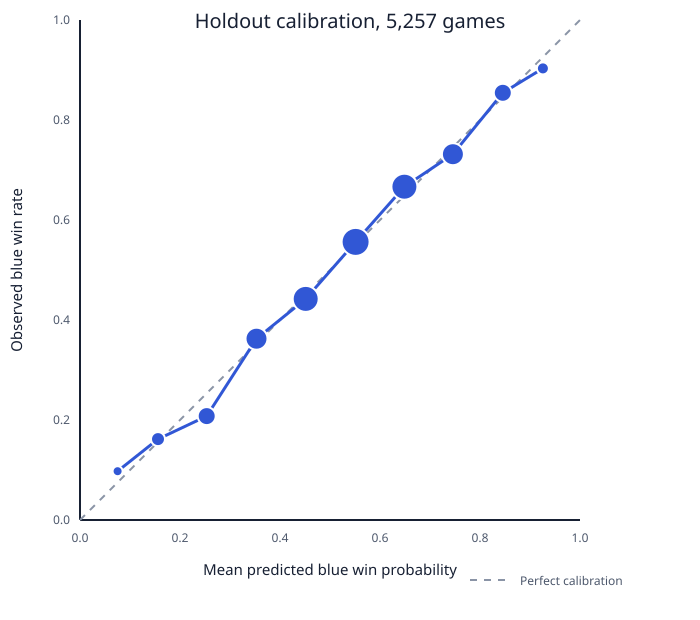
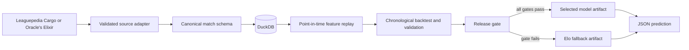

# LoL Esports Win Predictor

This project estimates the blue-side win probability for a professional League of Legends game from information available before the game begins.
It was motivated by an interest in competitive League, draft strategy, and the gap between an intuitive prediction and one that survives chronological testing.
The evaluated model uses team, roster, player, patch, side, series, pick, and ban history.
It never uses kills, gold, objectives, duration, or other in-game outcomes from the target game.

The repository is a research project and command-line tool, not a betting system or a claim of live predictive performance.

## Verified scope

- Fetches historical game and draft records from a pinned Leaguepedia Cargo export.
- Adapts Oracle's Elixir CSV and XLSX files through a separate ingestion command.
- Quarantines malformed source games instead of guessing missing values.
- Stores canonical matches and feature provenance in DuckDB.
- Replays team Elo, player Elo, form, roster, champion, patch, synergy, matchup, side, and series state in timestamp order.
- Compares blue-side frequency, Elo, logistic-regression ablations, histogram gradient boosting, and a fixed Elo/logistic blend.
- Uses rolling-origin development folds followed by fixed 2026 validation and holdout intervals.
- Saves checksum-verified model artifacts and uses the same feature builder for training and prediction.
- Provides unit, integration, leakage, repository-hygiene, and end-to-end tests.

This release does not use XGBoost, TensorFlow, a Siamese network, MLflow, or a Riot/AWS model baseline.
Those technologies appeared in legacy experiments or future-work notes but are not part of the verified release.

## Data and coverage

The verified snapshot comes from [Leaguepedia Cargo](https://lol.fandom.com/wiki/Special:CargoExport) and covers January 1, 2020 through July 30, 2026.
The pinned source file contains 95,579 games.
Canonical ingestion accepted 93,032 games and quarantined 2,547 games with missing or contradictory fields.
The snapshot includes major, regional, academy, amateur, showmatch, and other competitions listed by Leaguepedia, so it should not be interpreted as a majors-only dataset.

Leaguepedia states that content it can license is available under [CC BY-SA 3.0](https://lol.fandom.com/wiki/Leaguepedia%3ACopyrights).
Raw snapshots, databases, and derived model artifacts are ignored by Git.
Users should fetch the source directly, retain attribution, and verify the source terms before redistribution.

## Features and model

Every historical feature is calculated from matches strictly earlier than the target timestamp.
Feature groups include:

- Blue-side and known first-pick priors.
- Pre-match team and role-level player Elo.
- Recent team form, head-to-head history, roster experience, and roster continuity.
- Historical champion, player-champion, ban, synergy, and role-matchup strength.
- Patch number, game number, pre-game series score, and Fearless Draft exclusions when supplied.
- Coverage indicators so unknown teams, players, and champions fall back to neutral values instead of receiving fabricated history.

The frozen release compares seven candidates declared in `configs/current-release.yaml`.
Candidate selection uses validation log loss only.
The final holdout is evaluated once after selection.

## Evaluation

Estimator development ends before January 1, 2026.
Validation covers January 1 through March 31, 2026.
The final holdout contains 5,257 games from April 1 through July 30, 2026.
All figures below were reproduced from a fresh database and locked environment on July 31, 2026.

| Candidate | Validation log loss | Holdout log loss | Holdout accuracy |
| --- | ---: | ---: | ---: |
| Blue-side frequency | 0.6933 | 0.6909 | 53.40% |
| Elo only | 0.6571 | 0.6340 | 63.88% |
| Team and roster logistic | 0.6083 | 0.6043 | 67.17% |
| Draft-only logistic | 0.6835 | 0.6852 | 55.41% |
| Combined logistic | **0.6044** | 0.6005 | 67.57% |
| Histogram gradient boosting | 0.6050 | **0.6001** | 67.28% |
| 30% Elo plus 70% combined logistic | 0.6110 | 0.6036 | 67.57% |

The selected combined logistic model produced 0.6005 log loss, 0.2069 Brier score, 0.0140 expected calibration error, 0.7363 ROC-AUC, and 67.57 percent accuracy on the holdout.
It improved holdout log loss over Elo by 0.0335, with a series-clustered 95 percent interval from -0.0407 to -0.0264 for selected minus Elo.

The preregistered release gate still rejected the combined model because it regressed against Elo by 0.0167 log loss on the 272-game LPL slice, above the fixed 0.01 limit.
The release recommendation therefore falls back to the simpler Elo model.
This is a retrospective result on an opened holdout, not evidence of future or live performance.



The calibration plot shows ten equal-width probability bins for the selected combined logistic model.
The dashed diagonal represents perfect calibration, and point size reflects the number of games in each bin.

Full source hashes, quarantine counts, league breakdowns, and release-gate evidence are in [the release report](docs/current-release-results.md).

## Architecture



## Setup

Python 3.12 and [uv](https://docs.astral.sh/uv/) are required.

```bash
git clone https://github.com/links1234/lol-esports-win-predictor.git
cd lol-esports-win-predictor
uv sync --locked --all-groups
```

No API key is required for the documented Leaguepedia workflow.

## Data preparation

Fetch the pinned interval into the ignored `data/raw/` directory:

```bash
uv run lolpredictor fetch-leaguepedia \
  --output data/raw/leaguepedia-2020-2026.json \
  --start 2020-01-01T00:00:00+00:00 \
  --end 2026-07-30T19:00:00+00:00 \
  --retrieved-at 2026-07-30T20:35:32+00:00 \
  --page-size 5000
```

Ingest and generate point-in-time features:

```bash
uv run lolpredictor ingest-leaguepedia \
  --database var/current-release/matches.duckdb \
  --input data/raw/leaguepedia-2020-2026.json

uv run lolpredictor features \
  --database var/current-release/matches.duckdb \
  --config configs/current-release.yaml
```

## Train and evaluate

Run the rolling-origin development backtest without opening the final holdout:

```bash
uv run lolpredictor backtest \
  --database var/current-release/matches.duckdb \
  --config configs/current-release.yaml \
  --reports var/current-release/backtest-reports
```

Train the frozen candidate set, select on validation log loss, and evaluate the holdout:

```bash
uv run lolpredictor train \
  --database var/current-release/matches.duckdb \
  --config configs/current-release.yaml \
  --registry var/current-release/evaluation-artifacts \
  --reports var/current-release/release-reports
```

Apply the fixed release gates:

```bash
uv run lolpredictor release-gate \
  --config configs/current-release.yaml \
  --training-report var/current-release/release-reports/training-report.json \
  --backtest-report var/current-release/backtest-reports/backtest-report.json \
  --output var/current-release/release-reports/promotion-report.json
```

Re-evaluate the saved evaluation artifact in a separate process:

```bash
uv run lolpredictor evaluate \
  --database var/current-release/matches.duckdb \
  --artifact "EVALUATION_ARTIFACT_DIRECTORY" \
  --output var/current-release/release-reports/evaluation.json
```

## Prediction

Refit the gate recommendation through all accepted games:

```bash
uv run lolpredictor refit \
  --database var/current-release/matches.duckdb \
  --config configs/current-release.yaml \
  --training-report var/current-release/release-reports/training-report.json \
  --promotion-report var/current-release/release-reports/promotion-report.json \
  --registry var/current-release/production-artifacts \
  --reports var/current-release/production-reports
```

Predict a hypothetical completed draft whose timestamp is after the artifact cutoff:

```bash
uv run lolpredictor predict \
  --artifact "PRODUCTION_ARTIFACT_DIRECTORY" \
  --input examples/current_sample_draft.json \
  --output var/current-release/production-reports/sample-prediction.json
```

The verified Elo fallback example returned:

```json
{
  "blue_win_probability": 0.6419212836469772,
  "red_win_probability": 0.3580787163530228,
  "estimate_type": "post_draft_pregame",
  "data_cutoff_timestamp": "2026-07-30T18:12:00Z",
  "warnings": [
    "Unknown home regions: Hanwha Life Esports, Dplus Kia; using neutral regional priors"
  ]
}
```

Because the release gate chose Elo, this production example is team-strength sensitive but not draft sensitive.
The stronger combined model remains an evaluation artifact only.

## Tests and quality checks

Run the same checks used by CI:

```bash
uv lock --check
uv run ruff format --check .
uv run ruff check .
uv run mypy
uv run pytest --cov=src/lolpredictor --cov-report=term-missing --cov-fail-under=85
uv build
```

Run the complete legal synthetic fixture, including ingestion, feature replay, training, evaluation, artifact loading, and prediction:

```bash
uv run lolpredictor run-all --workdir var/fixture-run
```

## Repository structure

```text
configs/                  Frozen experiment and release settings
docs/                     Audit, architecture, and evidence reports
examples/                 Validated prediction requests
src/lolpredictor/         Ingestion, features, models, artifacts, and CLI
tests/unit/               Parsing, schema, feature, split, and model tests
tests/integration/        Shared data-to-prediction tests
tests/e2e/                User-facing command workflows
```

Generated databases, raw data, model binaries, reports, caches, virtual environments, MLflow state, and credentials are excluded by `.gitignore`.

## Limitations

- Leaguepedia is community-maintained and historical rows can change.
- The source population mixes competition tiers and includes non-target events.
- First-pick coverage is incomplete, and missing values are not inferred from side.
- Team and player aliases can change over time.
- The final 2026 holdout has been opened and cannot be reused to tune another model.
- The release gate selected Elo, so the recommended artifact does not use champion draft features.
- Prediction is exposed through a CLI and JSON contract, not a hosted API or automated live-draft service.

## Collaboration and attribution

This project began as collaborative work with [MauriceAK](https://github.com/MauriceAK).
Git history attributes the initial API scaffold and early ETL/model work to MauriceAK, and later API, data-processing, prediction, and experimental branches to Daud Asif.
The cleanup preserves both lineages and does not reuse legacy model binaries, raw data, credentials, or invalid performance claims.
See [the legacy audit](docs/legacy-audit.md) for the commit and methodology review.

## License

The original API README declared the project MIT-licensed, but neither source repository contains a license file and the history includes collaborative work.
The safest public release is to add an MIT `LICENSE` only after both contributors confirm that choice.
Leaguepedia-derived data remains subject to its separate CC BY-SA terms and is not bundled with this repository.
